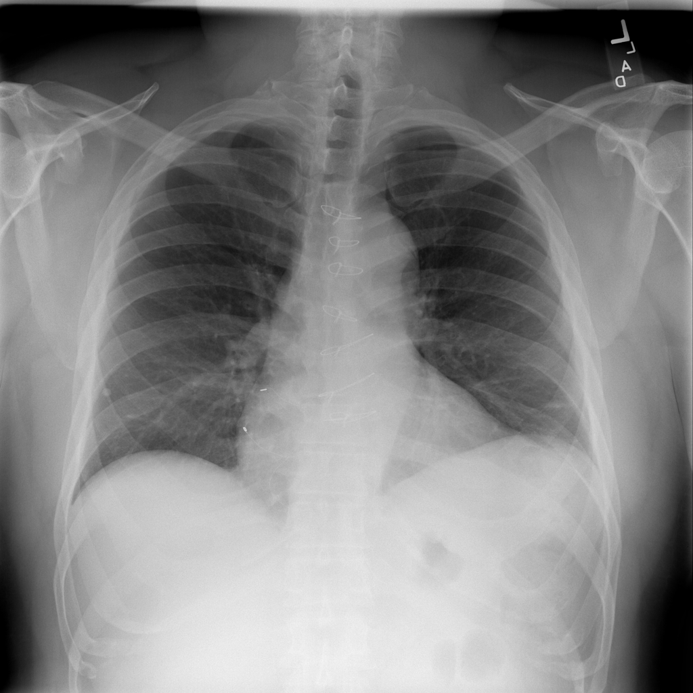

# Clinic Management System - Lung Disease & Cancer Diagnosis



A smart medical system backend built with Django REST Framework for detecting lung diseases and cancer stages using Deep Learning and Fuzzy Logic. Designed for doctors, patients, and secretariat.

---

## 🛠️ Software & Requirements

### Core Technologies
- **Backend**: Django REST Framework, SQLite
- **AI/ML**: PyTorch, scikit-learn, Fuzzy Logic
- **APIs**: RESTful endpoints for data integration

### Python Libraries
- numpy==1.23.5
- torch==2.0.1
- scikit-fuzzy==0.4.2
- pillow==9.4.0
- django==4.2

---

## Installation

1. **Clone the repository**  
   ```bash
   git clone https://github.com/yourusername/Clinic-Mangment.git
   ```
2. **Install dependencies**
   ```bash
   cd Clinic-Mangment
   pip install -r requirement.txt
   ```
3. **Migrate the database**
   ```bash
   python manage.py migrate
   ```
4. **Run the server**
   ```bash
   python manage.py runserver
   ```

---

## 📋 Use Cases

### 👨⚕️ For Doctors
- Diagnose 13 lung diseases from chest X-rays using a deep-learning model.  
- Predict lung cancer stages via fuzzy logic based on 9 symptom inputs.  
- View patient history and treatment archives.  

### 👤 For Patients
- Book appointments online.  
- Access diagnostic reports and treatment plans. 
- Diagnose a cancer and treatment if there.

### 🖥️ For Secertary
- Patient Appointment Management
- View patient files View and organize appointment schedules
- Managing working hours 

---

## 🤖 AI Components

### 1. Deep Learning Model (Multi-Class Lung Disease Detection)
- **Architecture:** ResNet-50  
- **Dataset:** 120,000 radiological images  
- **Classes:** 13 diseases (Atelectasis, Cardiomegaly, Edema, etc.)

!!! **NOTICE**:
    NEED TO DOWNLOAD WIEGHT OF MODEL, WE REMOVE THE WIEGHTS FOR SIZE OF PROJECT.

**Usage**:
```python
from lung_ai.Deep_Learing.LungModel import load_model

model = load_model('lung_ai/Deep_Learing/best_mlc_resnet50.pt')
prediction = model.predict(image_path)
```

### 2. Fuzzy Logic System (Cancer Stage Prediction)
This model contains several errors resulting from the research paper that we relied on, so DO NOT ADOPT IT AS A REFERENCE.
- **Inputs**: 9 variables (e.g., Age, Smoking)
   - the input variable should be numeric value consistent with the values specified in the Fuzzy Logic moodle code.

- **Output**: Disease progression stage (I–IV) and treatment recommendation.
